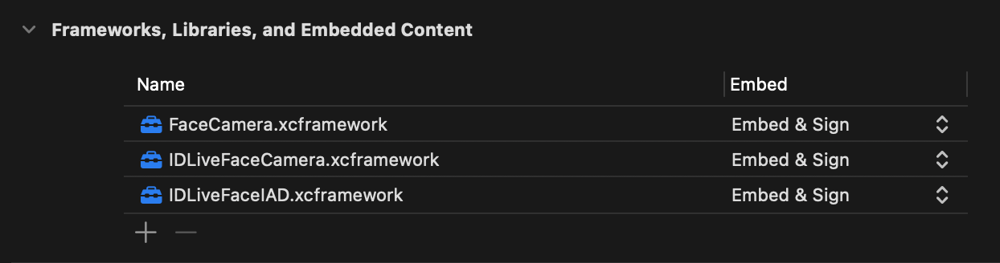

# `FaceCamera` Sample app


Here you can find an implementation example for the `FaceCamera` module. You'll see a SwiftUI approach in [`FaceCameraSampleAppSwiftUI`](./FaceCameraSampleAppSwiftUI/), and a `UIKit` implementation sample in the [`FaceCameraSampleApp`]() app target. You can find SDK documentation [here](https://smartcapture-docs.idscan.cloud/docs/ios/intro)

## Overview

The `FaceCamera` module provides a plug-and-play face capture component designed to simplify user identification workflows. This sample app demonstrates how to integrate and use the module in both SwiftUI and UIKit environments.

## Setup

1. Add the following XCFrameworks to `/Frameworks` [directory](./Frameworks/) and your project:
   - `FaceCamera.xcframework`
   - `IDLiveFaceCamera.xcframework`
   - `IDLiveFaceIAD.xcframework`

2. In your target’s **Frameworks, Libraries, and Embedded Content**, ensure all three are set to **Embed & Sign**.
    

3. Add an additional string catalog named `InfoPlist.xcstrings` to your project to localize the Info.plist file of your project. 

    - Add a key named NSCameraUsageDescription to customize the camera permission request message.
   ```xml
   <key>NSCameraUsageDescription</key>
   <string>This app requires camera access for identity verification.</string>
   ```

4. Customise the localised messages for the face camera module following the keys provided in the [documentation](https://smartcapture-docs.idscan.cloud/docs/ios/face-camera/customization)

5. Import the module where needed:
    ```swift
    import FaceCamera
    ```

## How to Run

- Open `FaceCameraSampleApp.xcodeproj`
- To try the SwiftUI implementation: select the `FaceCameraSampleAppSwiftUI` scheme and run.
- To try the UIKit implementation: select the `FaceCameraSampleApp` scheme and run.

## Requirements

- iOS 15.0+
- FaceCamera 1.0.2

## Agreement

- [End User License Agreement (“EULA”)](./EULA.txt)
